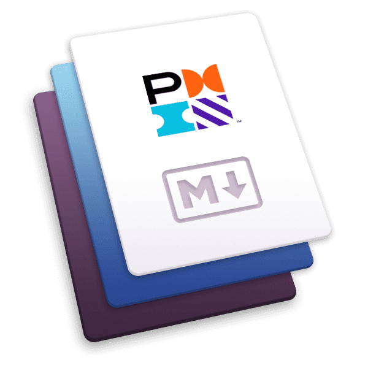
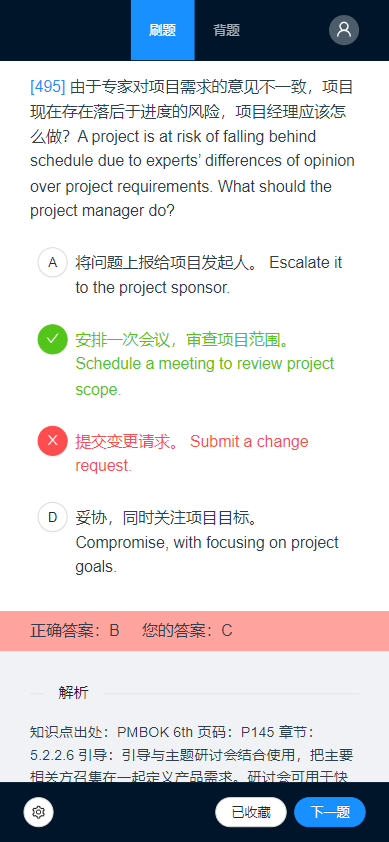

<h1 align="center">PMP BLUE BOOK</h1>

---

<p align='center'></p>

一个针对PMP考试的刷题小工具，理论上可以通过修改题库支持其他刷题需要。

## 功能介绍

### 已实现功能



- 支持**刷题**和**背题**模式（背题可以理解成看错题本）
- 刷题模式中已经做过的题会降低出现频率（50%）
- 答错的题自动收藏（可设置）
- 计分板
- 题库持续更新中...

### 待实现功能

- 支持背题模式显示答错的选项
- 支持在刷题模式设置只做收藏题或不做收藏题
- 支持多选题

## 系统介绍

### 前端

- 💥基于`Vue3`+`Vite2`
- 🗿UI库使用`Ant Design Vue`

### 服务器

- 💥基于`Koa`
- 🔑使用`jsonwebtoken`鉴权
- 💾`sqlite3`数据库

- 📑`log4js`记录日志
- 🔄使用`nodemon`支持热更新

### 综合

- 💥基于`TypeScript`

- 📐集成`ESlint(airbnb)`+`Prettier`+`EditorConfig`进行代码格式化

## 用法

### 安装

```bash
git https://gitee.com/wingsnow/pmp-blue-book.git

cd pmp-blue-book

npm install
```

### 运行项目（开发模式）

```bash
npm run vite # 仅前端
```

```bash
npm run watch-serve # 仅服务器（热更新）
```

```bash
npm run dev # 同时启动前端和服务器
```

### 打包构建

```bash
npm run build
```

### 运行项目（打包后）

```bash
npm run start
```

打包后会在生成`/dist`，该目录下是编译之后的服务器端代码；打包后的前端代码在`/dist/static`目录下。

如果是首次打包（或者删除`dist`目录后重新打包），还要将`/server/src`内的`secrets`目录整个复制到`/dist`目录下。

```bash
cp -r server/src/secrets dist
```

另外提供了一个精简版的`package.json`（`package.prod.json`），将包发布到生产环境时可以将该文件复制到`dist`目录下（并改名为`package.json`），从而减少在生产环境安装的依赖包。

```bash
cp package.prod.json dist/package.json
```

### 注意事项

#### 关于secrets目录

在`/server/src/secrets`目录内有三个文件，

- `db.db`：sqlite数据库文件，题库也在里面（questions表）。
- `jwt-key`：jsonwebtoken的密钥
- `salt`：md5加盐算法（用于加密用户密码）的盐

如果要用于生产用途或不想暴露密钥，请将`secrets`目录添加到`.gitignore`。

#### 用户密码

用户名和密码保存在数据库文件的users表中，初始用户密码为admin/admin，密码已经使用MD5加盐加密。

修改盐（`/server/src/secrets/salt`）后记得重新生成密码并更新数据表。

可以使用`server/src/utils/md5.ts`生成加密密码。

```bash
npx ts-node server/src/utils/md5 admin admin
# 第一个参数（admin）是用户名，第二个参数（admin)是密码
```

## 题目解析

内置了一个将固定格式（见`/utils/src.txt`）的题目转为json格式，以便后续处理或导入数据库存储的小工具。

用法见`/utils/README.md`
